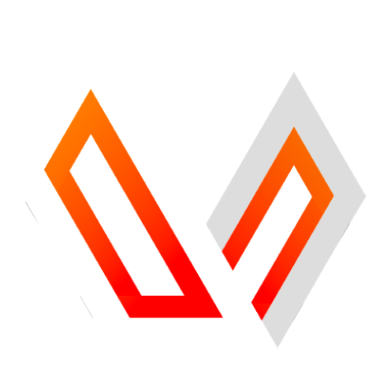

  

---

## 🚀 О проекте

**Space Station 14** — это захватывающая ролевая игра, вдохновлённая культовой Space Station 13. Погрузитесь в атмосферу космической станции, где каждое ваше действие может привести к неожиданным последствиям. Наш проект предлагает:

- Уникальный геймплей, поддерживаемый целым рядом сообществ.
- Интенсивное взаимодействие игроков в замкнутом пространстве станции.
- Постоянное развитие благодаря движку [Robust Toolbox](https://github.com/space-wizards/RobustToolbox), написанному на C#.

Это репозиторий нашего русского сервера по Space Station 14. Мы стремимся к полному переводу игры на русский язык, поддержке актуальных изменений из основного репозитория, а также добавлению собственных уникальных механик.

## Ссылки

[Наш Discord](https://discord.gg/nW73CdBYkg) | [Наша Вики](https://vanguardproject.ru/) | [Steam](https://store.steampowered.com/app/1255460/Space_Station_14/) | [Клиент без Steam](https://spacestation14.io/about/nightlies/) | [Основной репозиторий](https://github.com/space-wizards/space-station-14)

## Документация

На официальном сайте с [документацией](https://docs.spacestation14.io/) имеется вся необходимая информация о контенте SS14, движке, дизайне игры и многом другом. Также имеется много информации для начинающих разработчиков.

## Контрибьют

Мы рады принять вклад от любого человека. Заходите в Discord, если хотите помочь. У нас есть [список проблем](https://github.com/VG-SpaceStation14/VanGuardSS14/issues), которые нужно решить, и любой может за них взяться. Не бойтесь просить о помощи! Только убедитесь, что ваши изменения и PRы соответствуют [руководству по контрибьюту](https://docs.spacestation14.com/en/general-development/codebase-info/pull-request-guidelines.html).

## Сборка

1. Склонируйте этот репозиторий локально.
2. Запустите `RUN_THIS.py` для инициализации подмодулей и скачивания движка.
3. Скомпилируйте проект.

[Более подробная инструкция по запуску проекта.](https://docs.spacestation14.com/en/general-development/setup.html)

## Лицензия

Весь код репозитория лицензирован под [MIT](https://github.com/VG-SpaceStation14/VanGuardSS14/blob/master/LICENSE.TXT).

Большинство ассетов лицензированы под [CC-BY-SA 3.0](https://creativecommons.org/licenses/by-sa/3.0/), если не указано иное. Ассеты имеют свою лицензию и авторские права в файле метаданных. [Пример](https://github.com/VG-SpaceStation14/VanGuardSS14/blob/master/Resources/Textures/Objects/Tools/crowbar.rsi/meta.json).

Обратите внимание, что некоторые ассеты лицензированы на некоммерческой основе [CC-BY-NC-SA 3.0](https://creativecommons.org/licenses/by-nc-sa/3.0/) или аналогичной некоммерческой лицензией, и их необходимо удалить, если вы хотите использовать этот проект в коммерческих целях.
